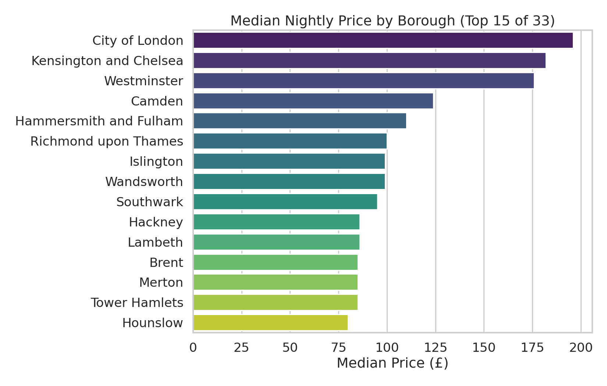
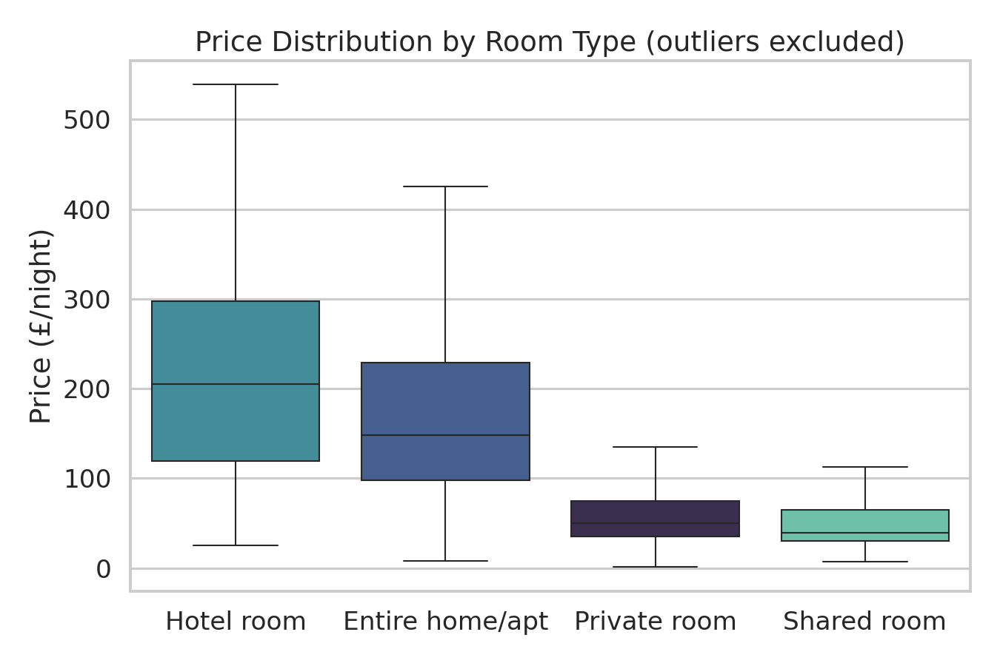
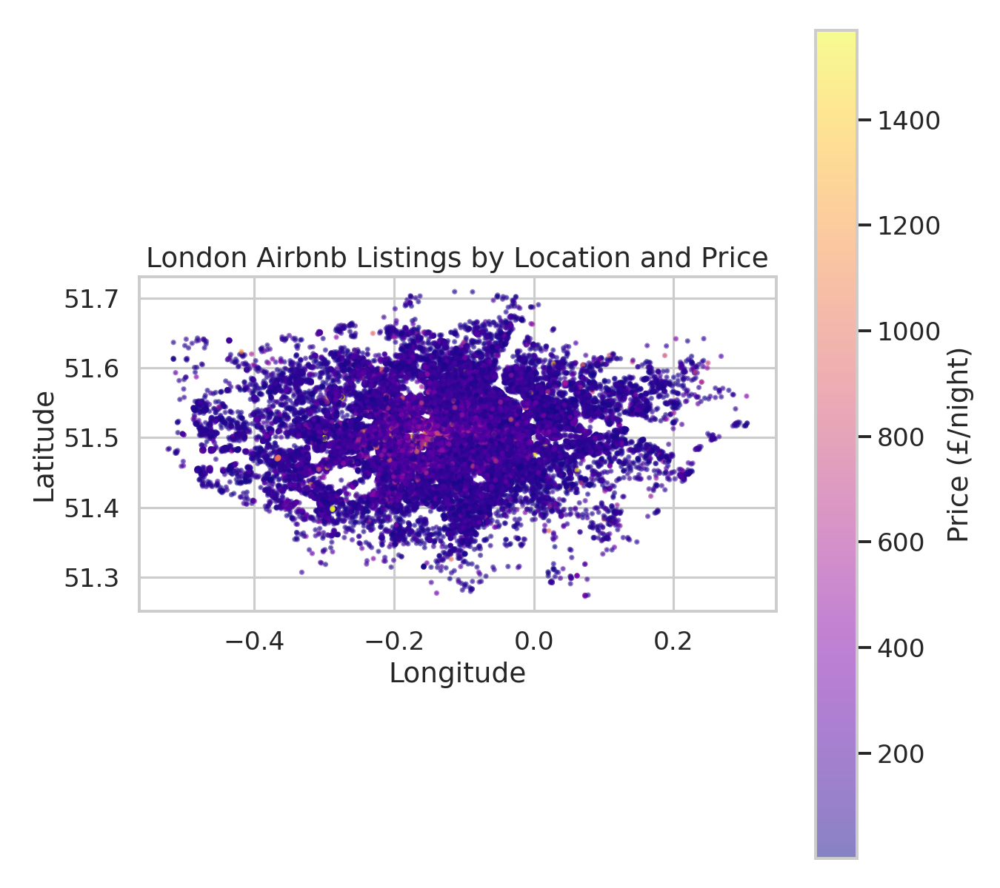
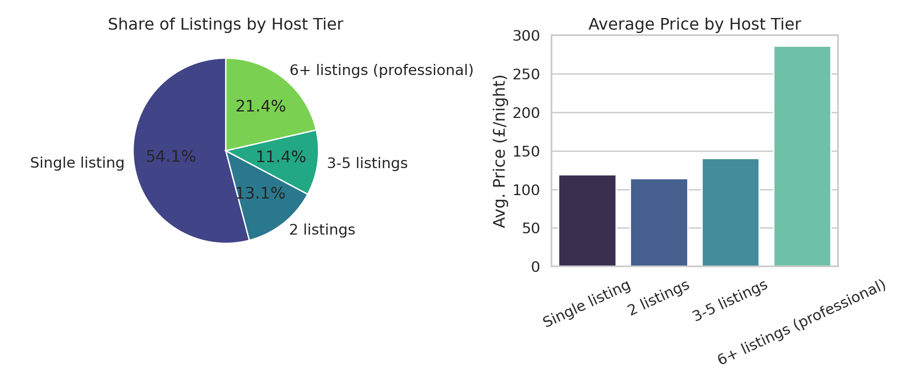
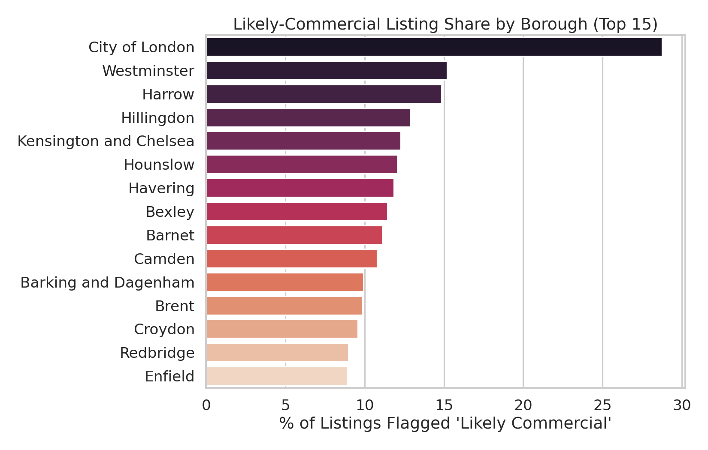
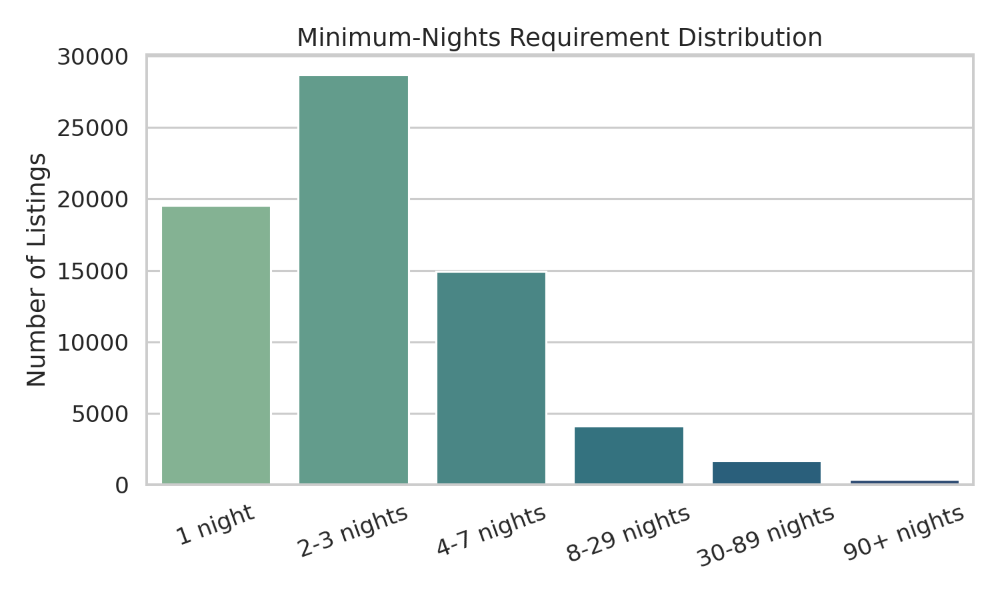
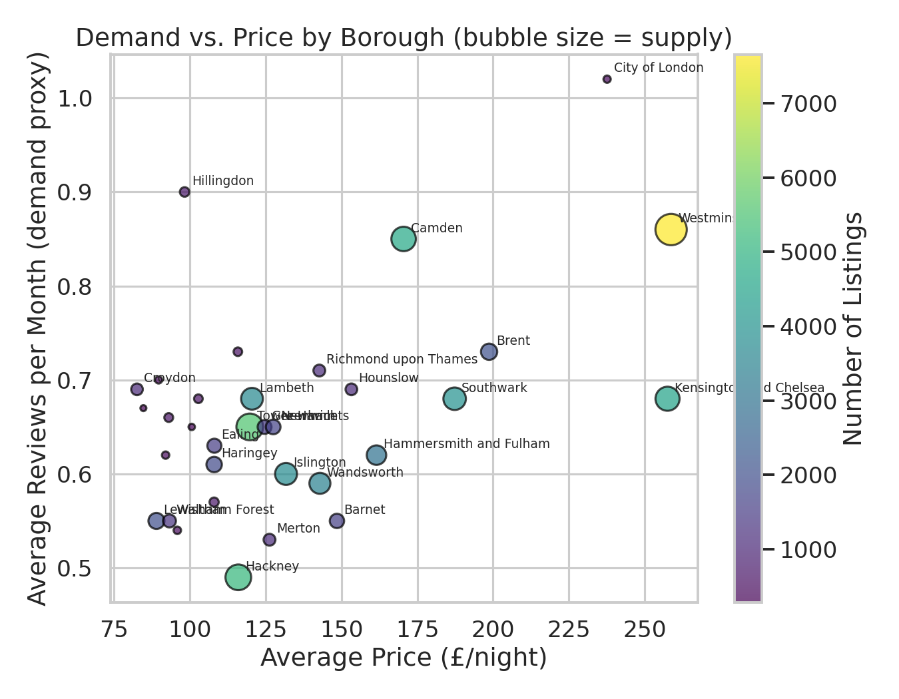

# London Airbnb Market Research: Pricing, Host Concentration & Commercial Listings
**Dataset:** Inside Airbnb London listings export (Kaggle) · 69,351 active listings · 33 boroughs · 45,229 unique hosts
**Prepared for:** Portfolio demonstration · **Prepared by:** [Your Name]
**Data note:** Real, publicly sourced short-term rental listing data. See [`README.md`](../README.md) and `src/clean_data.py` for full cleaning methodology and documented assumptions.

---

## 1. Executive Summary

The London Airbnb market shows a clear geographic price hierarchy, a meaningfully
"professionalized" supply side, and a small but identifiable cluster of likely-commercial
operations concentrated in specific boroughs. **Central boroughs (City of London, Kensington &
Chelsea, Westminster) command the highest median prices** (£176–£196/night, vs. a citywide median
of £99). **Nearly half of all listings (45.9%) belong to hosts who operate more than one
listing**, and hosts running 6+ listings charge an average of £286/night - roughly 2.4x the
£119/night average for single-listing hosts. Using a documented heuristic, **8.1% of all listings
(5,651) are flagged as likely-commercial operations** rather than genuine home-sharing, with that
share rising to **28.8% in the City of London** and **15.2% in Westminster** - the two boroughs
most relevant to any short-let regulatory review. Guest demand (proxied by reviews/month) does
**not** simply trade off against price: several high-price central boroughs post above-average
demand alongside their premium pricing, while a handful of lower-priced outer boroughs
(Hillingdon, Croydon, Bexley) also show above-average demand relative to their price point -
worth flagging as comparatively efficient, less-saturated markets.

---

## 2. Data & Methodology

The raw Kaggle export required real cleaning before analysis - a step this report treats as part
of the analytical work, not a footnote:

- **Two columns were entirely null** (`neighbourhood_group`, `license`) and were dropped.
- **19 listings priced at £0/night** were data errors, not valid rates, and are excluded from all
  price statistics (flagged via `is_zero_price`, not silently deleted from the dataset).
- **481 listings above the 99th percentile (£1,570+/night)** are flagged (`is_price_outlier`) and
  excluded from aggregate price statistics, since a small number of ultra-luxury listings would
  otherwise distort every mean calculation - **medians are used as the headline statistic
  throughout this report** given the strong right skew (mean £156 vs. median £99 citywide).
- **16,780 listings (24.2%) have no reviews yet** - `reviews_per_month` was set to 0 for these
  (correct business logic - "no reviews" isn't "unknown demand"), and they remain in all
  non-demand analyses.
- **A "likely commercial" flag** was engineered as: entire home/apt + host has 2+ listings +
  available 270+ days/year. This is a heuristic used in Inside Airbnb-style research to
  approximate professional short-let operations; it is **not** a confirmed regulatory or legal
  classification, and is presented as a screening signal, not a determination.

---

## 3. Pricing by Borough

| Borough | Listings | Median Price | 25th–75th Pctile |
|---|---:|---:|---:|
| City of London | 421 | **£196** | £130–£279 |
| Kensington and Chelsea | 4,532 | £182 | £115–£300 |
| Westminster | 7,659 | £176 | £100–£320 |
| Camden | 4,678 | £124 | £76–£200 |
| Hammersmith and Fulham | 2,968 | £110 | £65–£186 |
| ⋯ | | | |
| Hackney | 5,153 | £86 | £50–£140 |
| Newham | 1,677 | £76 | £40–£156 |

*(Citywide median: £99/night, outliers excluded. Full 33-borough table in `outputs/price_stats_by_borough.csv`.)*

The price hierarchy tracks central-London desirability closely, with a roughly 2.6x gap between
the most expensive borough (City of London, £196) and the cheapest tier of outer boroughs
(~£75–80). Interquartile ranges also widen substantially in the priciest boroughs (e.g.
Westminster's £100–£320 spread vs. Hackney's tighter £50–£140), reflecting a much wider mix of
listing quality/type competing in the same central locations.

**By room type:**

| Room Type | Median Price |
|---|---:|
| Hotel room | £205 |
| Entire home/apt | £148 |
| Private room | £50 |
| Shared room | £39 |

---

## 4. Geographic Distribution

Plotting every listing by latitude/longitude and coloring by price reproduces London's
recognizable shape and makes the central price premium visually unambiguous - the brightest
(highest-price) cluster sits squarely over the City of London / Westminster / Kensington core,
fading outward through the boroughs with essentially no sharp price "cliffs," consistent with a
market driven by continuous proximity-to-center value rather than borough-boundary effects alone.

---

## 5. Host Concentration & the "Professionalization" of Supply

| Metric | Value |
|---|---:|
| Herfindahl-Hirschman Index (HHI), listing ownership | 1.73 (out of 10,000) |
| Share of listings held by the top 10 hosts | 2.73% |
| Share of listings held by hosts with 2+ listings | **45.92%** |
| Unique hosts | 45,229 |

**The market is not dominated by a handful of mega-hosts** - the HHI is very low, and the top 10
hosts combined control under 3% of listings. But **it is far from a market of purely casual,
single-listing home-sharers either**: 54.1% of listings are single-listing hosts, while the
remaining 45.9% are split across hosts running 2, 3–5, or 6+ listings. Hosts in the "6+ listings"
tier - 21.4% of all listings - charge an average of **£286/night, roughly 2.4x** the £119/night
average for single-listing hosts, suggesting this segment skews toward higher-end, more
professionally managed properties rather than simply scaled-up versions of casual hosting.

---

## 6. Likely-Commercial Listings by Borough

| Borough | Total Listings | Likely Commercial | % Commercial |
|---|---:|---:|---:|
| City of London | 424 | 122 | **28.8%** |
| Westminster | 7,763 | 1,179 | 15.2% |
| Harrow | 444 | 66 | 14.9% |
| Hillingdon | 714 | 92 | 12.9% |
| Kensington and Chelsea | 4,612 | 566 | 12.3% |

The City of London - London's smallest and most tourist/business-dense borough - stands out
sharply, with nearly 3 in 10 listings meeting our likely-commercial criteria, more than double the
citywide average of 8.1%. Westminster, despite having 18x more listings, also shows an elevated
15.2% share. **These two boroughs are the natural priority segment** for anyone (a regulator, a
platform trust & safety team, or a competitive analyst) trying to understand professional
short-let activity in London, since they combine high absolute listing volume with a
disproportionate share of listings matching the commercial-use pattern.

**Minimum-nights distribution**, a secondary signal sometimes used to infer long-let workarounds:

The large majority of listings (69.6%) require 3 nights or fewer, consistent with genuine
short-let/tourism use; only 2.9% require 30+ nights, a small tail that may reflect a mix of
extended-stay strategies and, in some cases, an attempt to sidestep short-let-specific rules -
though this dataset alone cannot distinguish between those motivations.

---

## 7. Demand vs. Price

Using average reviews-per-month as a demand proxy (no direct booking or occupancy data is
available in this export), **demand does not simply trade off against price**. City of London,
Westminster, and Camden post both premium prices *and* above-average demand (0.85–1.02
reviews/month), suggesting genuinely strong, broad-based guest interest in central locations
rather than price sensitivity limiting demand there. At the same time, a set of lower-priced outer
boroughs - **Hillingdon (£98, 0.90 reviews/month), Croydon (£83, 0.69), and Bexley (£90, 0.70)** -
show demand levels comparable to or exceeding several pricier central boroughs, which stands out
as a potentially under-recognized opportunity for hosts or investors seeking a more favorable
demand-to-price ratio outside the most competitive core.

---

## 8. Key Findings Summary

1. **Central-London price premium is large and geographically continuous** - City of London tops the market at £196 median, roughly 2.6x the cheapest outer boroughs.
2. **The market is meaningfully professionalized**, with 45.9% of listings held by multi-listing hosts, and the largest-scale hosts (6+ listings) charging a substantial premium (£286 vs. £119/night).
3. **Likely-commercial activity is concentrated, not diffuse** - City of London and Westminster combine high listing volume with an outsized share of commercial-pattern listings, making them the clearest candidates for regulatory or platform-integrity attention.
4. **Guest demand and price are only loosely linked** - some premium boroughs sustain high demand at high prices, while a few specific outer boroughs (Hillingdon, Croydon, Bexley) offer an attractive demand-to-price ratio worth a closer look.

## 9. Limitations

This is a single-snapshot export (not a time series of bookings), so all "demand" figures are
proxies (reviews/month), not confirmed occupancy or revenue. The `likely_commercial` flag is a
transparent heuristic built from three observable fields, not a verified legal or regulatory
determination, and should be treated as a screening signal for further investigation rather than
a conclusion in itself.

---

*Full methodology, cleaning code, and every chart above are reproducible from the accompanying
repository: `src/clean_data.py` (cleaning), `src/metrics.py` (calculations),
`notebooks/research_analysis.ipynb` (full walkthrough), and `dashboard/app.py` (interactive
version with a live map and adjustable filters).*
